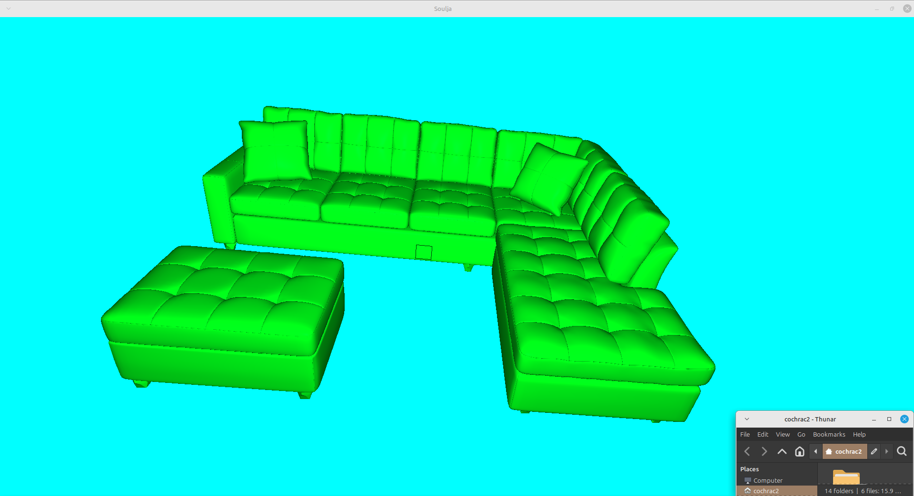
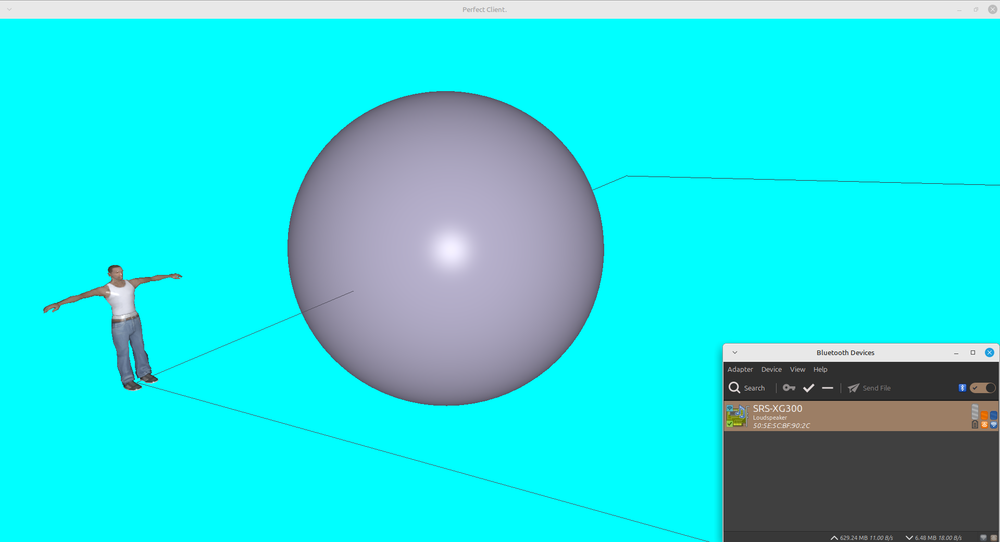
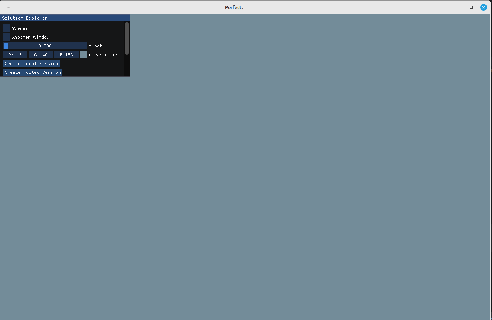

|                     |                 |
|---------------------|-----------------|
|Project Title:       | Real time collaboration software for interior designers |
|Student 1 Name:      | Caolan Cochrane |
|Student 1 ID:        | 22490802        |
|Student 2 Name:      | Ethan Doyle     |
|Student 2 ID:        | 22497082        |
|Project Supervisor:  | Mark Humphrys   |

### Introduction

We propose an online desktop application that allows interior designers to create a 3D space and interact in real time. 

Modern interior designers rely on software packages that make real-time collaboration difficult.
Designers, clients, and teams must exchange static files and screenshots, slowing down iteration and increasing the risk of miscommunication.
Our project proposes an online desktop application that enables users to create, edit, and explore interior spaces collaboratively in real time.
This bridges the gap between professional design tools and accessible web-based collaboration, offering an interactive 3D environment for co-creation, education, and client engagement.

### Outline

Our proposed project, Perfect, is an online desktop application that enables interior designers and creative professionals to collaboratively design and explore 3D spaces in real time. The system will allow multiple users to join a shared environment, create and manipulate objects as well as the scene itself (tone, hue, lighting manipulation, etc.), and visualise interior layouts interactively from any connected machine.

The application will be developed in C++ using OpenGL for rendering and SDL3 for input and window management, for high-performance real-time graphics. Real-time collaboration will be achieved through a WebSocket-based networking layer, allowing scene data and object transformations to stay synchronised across all clients. We expect the rest of the communication to be standard requests.

Key system components will include:

Rendering engine: built on OpenGL to support lighting, materials, textures, and geometric transformations.
GUI: Built with ImGui, this is how our users will join and interact with scenes.
    Scene management: handles loading, saving, importing, and exporting 3D environments and models via glTF using tinyglTF.
    Object manipulation tools: for moving, rotating, scaling, and colouring interior elements.
    User interface and interaction: intuitive camera controls, snapping, and simple menus for adding and modifying objects.

Server layer: Single source of truth, synchronises scene state between users in real time, allowing multi-user editing and communication.

Extensibility: designed as a modular framework.

The project will culminate in a functional prototype that demonstrates live collaboration and interactive 3D design within a shared space.
We see the project in a staged approach. We define finishing the implementation of interior design as the minimum viable product for our project. But if we complete this MVP, we would like to see what fields interior designers interact with and which would be most useful to implement functionality for. If you imagine interior decorators and architechts working on the same project and communication ideas in real time, you start to see the possibilities for the project.

### Background

Our third-year project involved developing a procedurally generated world game using TypeScript, Three.js, and WebSockets in a listen–server architecture. This experience introduced us to the fundamentals of real-time rendering, scene management, and networked interaction within 3D environments.

For our final-year project, we aim to build upon that foundation while expanding into more sophisticated and professional-grade software development. We decided to move from a browser-based application to a desktop application, as this approach better aligns with the requirements of high-performance 3D rendering and collaborative interaction. It also allows greater control over resource management and avoids the performance trade-offs associated with running in a browser environment.

We have chosen to develop the system in C++ for its performance advantages and low-level control, as well as to avoid some of the limitations and quirks encountered in TypeScript. The graphics layer will be implemented using OpenGL, which provides direct access to GPU capabilities and is well suited for real-time visualisation. To ensure reliable and portable builds across development environments, we will use CMake as our build system, addressing the “works on my machine” issues we encountered previously.

Finally, we plan to incorporate automated testing from an early stage — a key improvement over last year’s project. As the project scales in complexity, a structured testing framework will be invaluable in maintaining stability and verifying that real-time synchronisation, rendering, and scene management behave as expected.
### Achievements

The completed project will deliver a functional real-time collaborative 3D design application that allows multiple users to interact within shared virtual spaces. Users will be able to create, modify, and explore interior environments collaboratively.

From a technical perspective, the system will have:
- Real-time multi-user collaboration through synchronised scene state management over WebSockets.
- A  3D rendering engine built on OpenGL, capable of displaying textured, lit, and manipulable objects within complex scenes.
- Scene management, including model import/export using glTF and tinyglTF, and the ability to save and load interior layouts.
- An intuitive ImGui-based user interface, enabling users to join sessions, manipulate objects, and modify environmental attributes such as lighting, tone, and colour.
- A modular, extensible codebase that can be expanded with additional systems such as physics, materials, or educational visualisation modules.
- Automated testing and cross-platform build support via CMake, ensuring project stability and reproducibility.

The project will culminate in a fully operational prototype demonstrating the potential of real-time collaborative interior design. Beyond its initial scope, it will serve as a foundational framework for creative collaboration — adaptable to educational contexts, 3D modelling, or architectural visualisation.

### Justification

Most interior design tools today are made for single users. Designers often have to send screenshots or exports back and forth to get feedback, which slows down progress and can lead to confusion or lost ideas. With Perfect, we want to make that process faster and more natural by letting multiple people design and explore the same 3D space together in real time.

This kind of shared environment would make it easier for designers and clients to communicate and experiment with ideas on the spot — changing layouts, lighting, and materials while everyone sees the same updates live. It could also help small teams or freelancers work together remotely without relying on heavy or expensive commercial software.

Our main goal is to build something focused on interior design, but we also see potential for it to grow into related areas like architecture, decoration, and spatial planning. The core features—real-time collaboration, 3D visualisation, and shared editing—would easily carry over to those fields.

Overall, we think this project is worthwhile because it brings real-time collaboration to an area that doesn’t really have it yet, and because it’s something both useful and achievable for us as a final-year project.

### Programming language(s)

Client and Server will be written in C++. 
Python may be used to create light functionality, such as file conversion scripts. 
Shaders will be written in GLSL.

### Programming tools / Tech stack

Software that will be used in this project includes:

Simple DirectMedia Layer (SDL): SDL is a cross-platform development library designed to provide low level access to audio, keyboard, mouse, joystick, and graphics hardware via OpenGL. [1] 

OpenGL: OpenGL is a cross-platform API that enables developers of software for PC, workstation, and supercomputing hardware to create high-performance, visually compelling graphics software applications. OpenGL is muc simpler than Vulkan, even if the API has not been updated since 2017. Research shows that this doesn't limit the capabilitiy of the API, but rather that it is not as efficient with regards to performance. We can expect to take a 25% hit in the worst case, but it varies case by case. [2]

WebSockets: WebSockets provides a persistent full-duplex communication channel between the client and server - essentially, a two-way communication session between a user’s client and a server. 
Helps to enable the listen-server architecture.

CMake: CMake is an open source, cross-platform family of tools designed to build, test, and package software. [3]
We are using this to build all necessary components in our project.

GLTF: A file format for describing a 3D scene. It bridges the gap between other file formats. Anything can be converted to GLTF. This is an excellent starting file format to load.

Compilers used:

GNU Compiler Collection (GCC): A collection of compilers that support various programming languages. 
We will be using this for C++.

MinGW: An open-source and free compiler that brings the GNU Compiler Collection to Windows. 
In this project, it is used for its ability to use the GCC compiler for C++ in Windows.

IDEs:

CLion: CLion is a cross-platform IDE. The project has not yet been decided as commercial, and we can continue with non-commercial licences for now but will need to review this very soon.

### Hardware

Might need a computer with a powerful GPU to show off the project (specifically for demo), but not 100% necessary.

### Learning Challenges

Replication is a very hard problem when it comes to real time networked interaction. This shows up in multiplayer games all the time. But in this instance we are quite fortunate; the server acts as the single source of truth,
but we don't necessarily need to validate client's inputs to the extent we would if we were creating a videogamewhere we need to prevent cheating. We also don't likely need to optimize by subsetting the objects in our scene, as scenes are not expected to be ridiculously huge. But consistent replication is fundamental to a smooth experience for users.

OpenGL is a low level graphics API. This means direct communication with the GPU, custom serialisation of data entering the buffers, writing our own shaders 

Depending on the number of 3D object file formats we decide to support initially, we will need to learn these file formats and their structures very well.

### Breakdown of work

We maintain that we will both actively work on the project, prioritizing areas that we agree on together and contributing equally.

### Risk Register

Description: Replication Complexity
Replication can introduce many unexpected bugs
Likelihood: High
Severity: Medium
Mitigation: A testing framework where we simulate a server getting hit with API requests from multiple clients, editing the scene. Need cases such as both clients editing the same object etc.

Description:  Programming overheads. 
These can be caused by many different aspects of our project. 
A possible overhead is when many models are loaded onto a scene, which could happen if someone is using the space for a very large project.

Likelihood: Almost guaranteed at some point with a project of this manner.

Severity: Depends on the overhead.

Mitigation: Reducing the overheads through optimisation and faster methods and using techniques such as occlusion culling for rendering, instanced rendering, utilising index buffers where possible, efficient VBO serialisation 

Description: Hardware constraints. 
This risk can be tied with the above, as poorer hardware can cause lag in areas that better hardware may not experience. We will need to optimize and support runtime settings for graphics.

Likelihood: Small-Medium

Severity: Same as above.

Mitigation: Building the software on computers without a graphics card, and optimize for this use case.

### Current Progress

We have already begun early development in the same repository to explore the feasibility of our approach and familiarise ourselves with the technologies involved. This early prototype includes basic rendering, lighting, a GUI, and model loading. These components serve as a foundation for the full project. Our focus so far has been on learning and testing the frontend technologies. The main development phase will build on this groundwork to implement the networking, collaboration, scene management, and testing systems described in this proposal. We have included some screenshots of the prototypes. The lighting is bling-phong, whereas we would hope to use physically based rendering in our final implementation. The light source is the camera's position. The models are loaded with GLTF, and the primitives use a small C libary.

  

  

  

### References

[1]     SDL, "About SDL", *Simple Direct MediaLayer*. [Online]. Available: https://www.libsdl.org/

[2]     Khronos Group, "OpenGL - The Industry's Foundation for High Performance Graphics", *Khronos Group*. [Online]. Available: https://www.khronos.org/opengl/

[3]     kitware inc., "Software Development with CMake", *CMake*. [Online]. Available: https://cmake.org/about/

